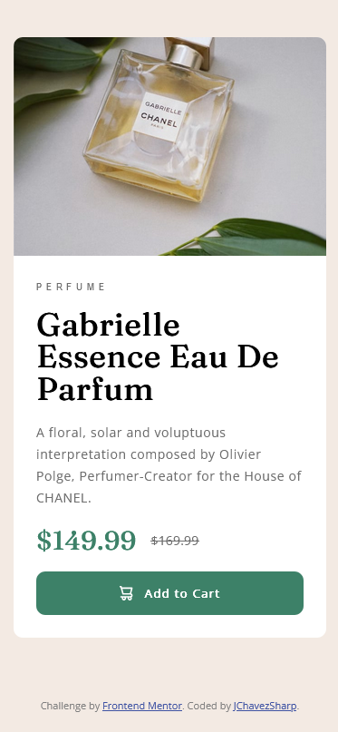

# Frontend Mentor - Product preview card component solution

This is a solution to the [Product preview card component challenge on Frontend Mentor](https://www.frontendmentor.io/challenges/product-preview-card-component-GO7UmttRfa). Frontend Mentor challenges help you improve your coding skills by building realistic projects. 

## Table of contents

- [Overview](#overview)
  - [The challenge](#the-challenge)
  - [Screenshot](#screenshot)
  - [Links](#links)
- [My process](#my-process)
  - [Built with](#built-with)
  - [What I learned](#what-i-learned)
  - [Useful resources](#useful-resources)
- [Author](#author)
- [Acknowledgments](#acknowledgments)

## Overview

### The challenge

Users should be able to:

- View the optimal layout depending on their device's screen size
- See hover and focus states for interactive elements

### Screenshot



### Links

- Solution URL: [Add solution URL here](https://your-solution-url.com)
- Live Site URL: [Add live site URL here](https://your-live-site-url.com)

## My process

### Built with

- CSS Flexbox and media queries
- Mobile-first workflow

### What I learned

With this challenge I was able to practice the use of CSS flexbox. The card is a flexbox with 2 children. The product description is also made with flexbox. The prices and the inside of the button is also a flexbox. Why did I use flexbox this much? It makes layouts very easy and it makes it easy to center items, flexbox is also key to a responsive layout that adapts to different screen sizes.

For example: the `product card` div is a flexbox, for mobile screens it is set to `flex-direction: column` (this is the default in the CSS, this was built mobile first) while it is set to `flex-direction: row` for larger screen sizes (detected with a CSS media query.)


```css
.product-card {
    background-color: var(--white);
    border-radius: 10px;
    display:flex;
    flex-direction: column;
    margin: 4%;
}
```
```css
@media (min-width: 660px) {
    .product-card {
    flex-direction: row;
    max-width: 600px;
    height: 450px;
    }
```

### Useful resources

- [A Complete Guide to Flexbox](https://css-tricks.com/snippets/css/a-guide-to-flexbox/) - The flexbox bible from CSS tricks

## Author

- Frontend Mentor - [@JChavezSharp](https://www.frontendmentor.io/profile/JChavezSharp)
- X aka Twitter - [@JChavezSharp](https://twitter.com/JChavezSharp)

## Acknowledgments

Thanks to Kevin Powell's YouTube channel for his excellent CSS tutorials and to John Duckett for his book HTML & CSS.